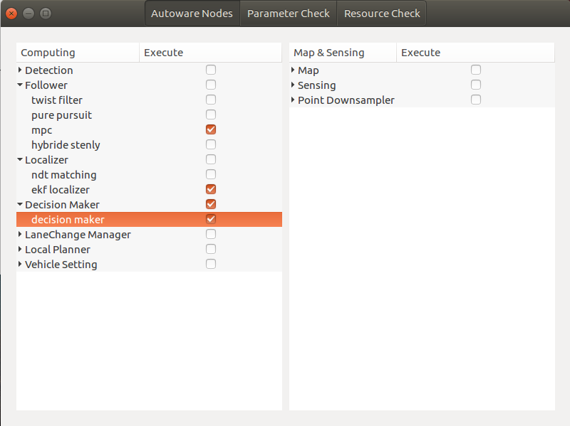

# runtime-manager-lite
* Autoware의 runtime manager를 새로 구성하여 현재 개발하고 있는 자율주행자동차에 필요한 노드을 쉽게 구동할 수 있도록 구성하였습니다.
* 제 레포지토리 중 qt lidar detection 노드를 구동 할 수 있도록 추가하였습니다.
* 기존 runtime manager에는 없는 lane change 기능을 제 레포지토리 중 Lane Change Manager 노드를 추가하여 가능하도록 하였습니다.
* runtime manager에 없는 자율주행을 위해 필요한 노드가 제대로 켜져있는지, 죽었는지 체크하는 기능을 추가할 예정입니다.
* runtime manager를 구동하므로써 사용하지 않는 기능으로 인한 리소스 낭비를 최소화 하였습니다.

# Functions
* E-stop Routine : 차량이 급제동하거나 사고가 났을 때 E-STOP할경우 모든노드의 정보를 큐에 저장하고 모든 노드를 해제.
* Rerun Routine : E-stop 이 끝나고 시스템을 재 구동할 때 사용. 노드의 정보가 저장된 큐를 이용하여 모든 시스템 재 가동.
* Alive Nodes Check : 노드가 알맞은 토픽을 잘 발행하고 있는지, 살아있는지 검사.
* Quick Start : 사용자가 원하는 quick start routine을 yaml 파일로 형식에 맞게 추가하여 구동가능.

# Run
```sh
$ roslaunch autoware_lite adas_manager.launch
```
```sh
# this launch file with ichthus that is ssu Autonomos vehicle 
$ roslaunch autoware_lite ichthus_manager.launch
``` 

# Result
1. GUI (nodes) planning quick start.



2. GUI (param & alive check) LiDAR detector on.


1. GUI (resource check)

